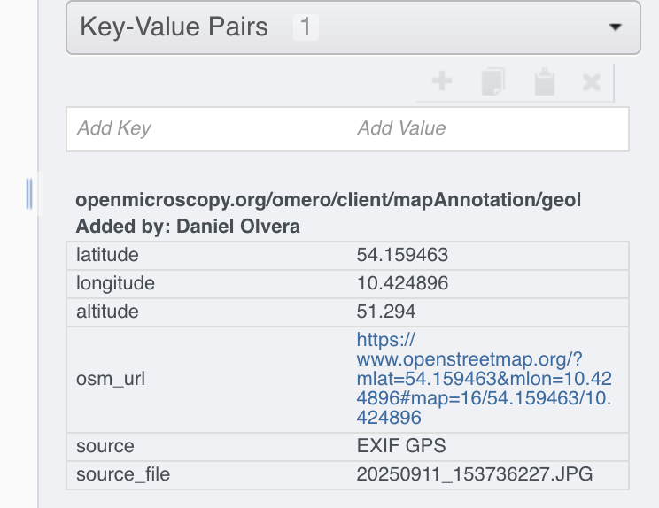
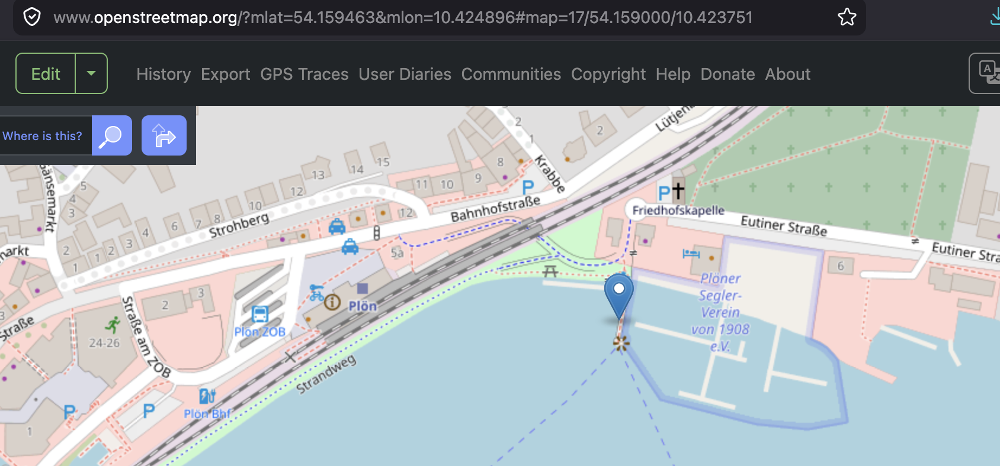

# omero-gps-scripts

A collection of OMERO scripts for creating geolocation MapAnnotations from image GPS metadata.

Many digital cameras saved GPS coordinates directly in the image EXIF metadata, while others store GPS positions in separate GPS logging files.
These scripts automate the extraction of that information and store it as standard OMERO MapAnnotations.

The resulting annotations can later be exposed through RDF mappings and queried using GeoSPARQL engines such as QLever.


## Current scripts

- **Add_GPS_annotations.py** Extracts GPS metadata directly from the original image files already stored in OMERO.

- **GPS_extract.py** Extract GPS metadata from original image files and generate a CSV ready for the standard **Import from CSV** OMERO script.

- **GPS_log_annotations.py**. Adds geolocation annotations using a separate GPS logging file.

# Requirements

These scripts are intended to run as **OMERO.web scripts**, They require the **Exiftool** package installed in the OMERO.server.

```bash
which exiftool
exiftool -ver
```

When running omero in docker container, access the container and install **Exiftool**  (`dnf install -y perl-Image-ExifTool`)

```bash
docker exec --user root -it <omero-container> bash
```


## Native OMERO installation

Copy the script into the OMERO annotation scripts directory.

```bash
sudo cp GPS_annotations.py \
/opt/omero/server/OMERO.server/lib/scripts/omero/annotation_scripts/
```

Set the correct ownership.

```bash
sudo chown omero-server:omero-server \
/opt/omero/server/OMERO.server/lib/scripts/omero/annotation_scripts/GPS_annotations.py
```

Become the OMERO server user.

```bash
sudo su - omero-server
```

Upload the script.

```bash
omero script upload \
$OMERODIR/lib/scripts/omero/annotation_scripts/Add_GPS_annotations.py
```

## Docker OMERO installation

First identify the OMERO server container using `docker ps`

### Copy the script

```bash
docker cp Add_GPS_annotations.py \
<omero-container>:/opt/omero/server/OMERO.server/lib/scripts/omero/annotation_scripts/
```

### Restart the OMERO server container

```bash
docker restart <omero-container>
```


# Usage

## Add_GPS_annotations.py

`Add_GPS_annotations.py` extracts GPS metadata from image EXIF metadata and creates geolocation MapAnnotations directly on OMERO Images.

The script only works when images have already been uploaded to OMERO and the original image files still contain GPS metadata.

For each selected Image, the script:

1. Finds the OMERO `OriginalFile` associated with the Image.
2. Downloads the original file temporarily.
3. Reads GPS EXIF metadata using ExifTool.
4. Creates a geolocation MapAnnotation.
5. Links the annotation to the Image.
6. Deletes the temporary file.

The script can process either all images in a Dataset or selected individual images


### Annotation keys

The script creates the following key-value pairs:

| Key | Description |
|-----|-------------|
| `latitude` | Latitude in decimal degrees |
| `longitude` | Longitude in decimal degrees |
| `altitude` | Altitude from EXIF GPS metadata, or `NA` if unavailable |
| `osm_url` | OpenStreetMap link for the coordinates |
| `source` | Set to `EXIF GPS` |
| `source_file` | Original image filename |

### Namespace

The default namespace is:

```text
openmicroscopy.org/omero/client/mapAnnotation/geolocation
```

The resulting annotation appears as a standard OMERO MapAnnotation attached to the Image.

<p align="center">
  
</p>

The `osm_url` entry provides a direct link to the position in OpenStreetMap.
<p align="center">
  
</p>