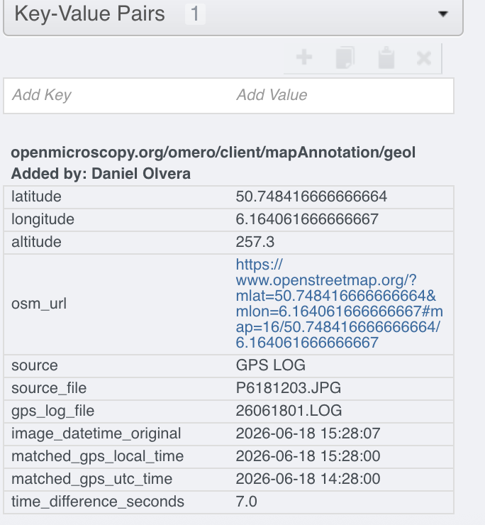

# omero-gps-scripts

A collection of OMERO scripts for creating geolocation MapAnnotations from image GPS metadata.

Many digital cameras saved GPS coordinates directly in the image EXIF metadata, while others store GPS positions in separate GPS logging files.
These scripts automate the extraction of that information and store it as standard OMERO MapAnnotations.

The resulting annotations can later be exposed through RDF mappings and queried using GeoSPARQL engines such as QLever.


## Current scripts

- **Add_GPS_annotations.py** Extracts GPS metadata directly from the original image files already stored in OMERO.

- **GPS_extract.py** Extract GPS metadata from original image files and generate a CSV ready for the standard **Import from CSV** OMERO script.

- **GPS_log_annotations.py**. Adds geolocation annotations using a separate GPS logging file.

# Requirements

These scripts are intended to run as **OMERO.web scripts**, They require the **Exiftool** package installed in the OMERO.server.

```bash
which exiftool
exiftool -ver
```

When running omero in docker container, access the container and install **Exiftool**  (`dnf install -y perl-Image-ExifTool`)

```bash
docker exec --user root -it <omero-container> bash
```


## Native OMERO installation

Copy the script into the OMERO annotation scripts directory.

```bash
sudo cp GPS_annotations.py \
/opt/omero/server/OMERO.server/lib/scripts/omero/annotation_scripts/
```

Set the correct ownership.

```bash
sudo chown omero-server:omero-server \
/opt/omero/server/OMERO.server/lib/scripts/omero/annotation_scripts/GPS_annotations.py
```

Become the OMERO server user.

```bash
sudo su - omero-server
```

Upload the script.

```bash
omero script upload \
$OMERODIR/lib/scripts/omero/annotation_scripts/Add_GPS_annotations.py
```

## Docker OMERO installation

First identify the OMERO server container using `docker ps`

### Copy the script

```bash
docker cp Add_GPS_annotations.py \
<omero-container>:/opt/omero/server/OMERO.server/lib/scripts/omero/annotation_scripts/
```

### Restart the OMERO server container

```bash
docker restart <omero-container>
```


# Usage

## Add_GPS_annotations.py

`Add_GPS_annotations.py` extracts GPS metadata from image EXIF metadata and creates geolocation MapAnnotations directly on OMERO Images.

The script only works when images have already been uploaded to OMERO and the original image files still contain GPS metadata.

For each selected Image, the script:

1. Finds the OMERO `OriginalFile` associated with the Image.
2. Downloads the original file temporarily.
3. Reads GPS EXIF metadata using ExifTool.
4. Creates a geolocation MapAnnotation.
5. Links the annotation to the Image.
6. Deletes the temporary file.

The script can process either all images in a Dataset or selected individual images


### Annotation keys

The script creates the following key-value pairs:

| Key | Description |
|-----|-------------|
| `latitude` | Latitude in decimal degrees |
| `longitude` | Longitude in decimal degrees |
| `altitude` | Altitude from EXIF GPS metadata, or `NA` if unavailable |
| `osm_url` | OpenStreetMap link for the coordinates |
| `source` | Set to `EXIF GPS` |
| `source_file` | Original image filename |

### Namespace

The default namespace is:

```text
openmicroscopy.org/omero/client/mapAnnotation/geolocation
```

The resulting annotation appears as a standard OMERO MapAnnotation attached to the Image.

<p align="center">
  
</p>

The `osm_url` entry provides a direct link to the position in OpenStreetMap.
<p align="center">
  
</p>


## Export_GPS_to_csv.py

`Export_GPS_to_csv.py` extracts GPS metadata from image EXIF metadata and creates a downloadable CSV file.

Users can review, edit, or validate GPS metadata before using the csv to add annotations. The generated csv can be imported using the standard **Import from csv** script.

For each selected Image, the script:

1. Finds the OMERO `OriginalFile` associated with the Image.
2. Downloads the original file temporarily.
3. Reads GPS EXIF metadata using ExifTool.
4. Writes the GPS metadata into a CSV row.
5. Attaches the CSV to the selected Dataset or Image as a FileAnnotation.
6. Deletes the temporary image file and temporary CSV file from the server.

### CSV columns

The script creates a CSV with the following columns:

| Column | Description |
|--------|-------------|
| `OBJECT_ID` | OMERO Image ID |
| `OBJECT_NAME` | OMERO Image name |
| `latitude` | Latitude in decimal degrees |
| `longitude` | Longitude in decimal degrees |
| `altitude` | Altitude from EXIF GPS metadata, or `NA` if unavailable |
| `osm_url` | OpenStreetMap link for the coordinates |
| `source` | Set to `EXIF GPS` |
| `source_file` | Original image filename |

Images without GPS metadata are still included in the CSV, but the GPS fields are left empty.

## Add_GPS_annotations_with_file.py

`Add_GPS_annotations_with_file.py` adds geolocation MapAnnotations to OMERO Images using an external GPS logging file.

This script is useful when images do not contain GPS coordinates directly in their EXIF metadata, but a separate GPS logger recorded positions during image acquisition.

The script matches each image timestamp against the nearest GPS fix in the attached logging file and creates MapAnnotations using the same geolocation schema as `Add_GPS_annotations.py`.

### Supported GPS logging files

Currently supported:

- OM System `.LOG`

Future versions may add support for GPX and other common formats.

For each selected Image, the script:

1. Finds the OMERO `OriginalFile` associated with the Image.
2. Downloads the original image temporarily.
3. Reads the image EXIF `DateTimeOriginal` value using ExifTool.
4. Loads GPS fixes from the attached GPS logging file.
5. Converts GPS UTC timestamps to local camera time using the LOG file header offset.
6. Finds the nearest GPS fix within 45 seconds.
7. Creates a geolocation MapAnnotation.
8. Deletes all temporary files.

The script can process either all images in a Dataset or selected individual images

The script creates the following key-value pairs:

| Key | Description |
|-----|-------------|
| `latitude` | Latitude in decimal degrees |
| `longitude` | Longitude in decimal degrees |
| `altitude` | Altitude from the GPS logging file, or `NA` if unavailable |
| `osm_url` | OpenStreetMap link for the coordinates |
| `source` | Set to `GPS LOG` |
| `source_file` | Original image filename |
| `gps_log_file` | GPS logging filename |
| `image_datetime_original` | EXIF image timestamp |
| `matched_gps_local_time` | Matched GPS timestamp converted to local time |
| `matched_gps_utc_time` | Original matched GPS UTC timestamp |
| `time_difference_seconds` | Time difference between the image timestamp and matched GPS fix |

### Example annotation

The figure below shows a MapAnnotation created by `Add_GPS_annotations_with_file.py`.

Unlike the EXIF-based workflow, the annotation stores not only the geographic coordinates but also the information used during the timestamp matching process. 

<p align="center">
  
</p>


The additional fields are:

- **gps_log_file** – the GPS logging file generated by the camara (in this case from  OM system).
- **image_datetime_original** – the timestamp retrieved from the image (`DateTimeOriginal`).
- **matched_gps_local_time** – the GPS timestamp after conversion from UTC to the camera's local time.
- **matched_gps_utc_time** – the original UTC timestamp recorded in the GPS log.
- **time_difference_seconds** – the time difference between the image timestamp and the selected GPS fix.